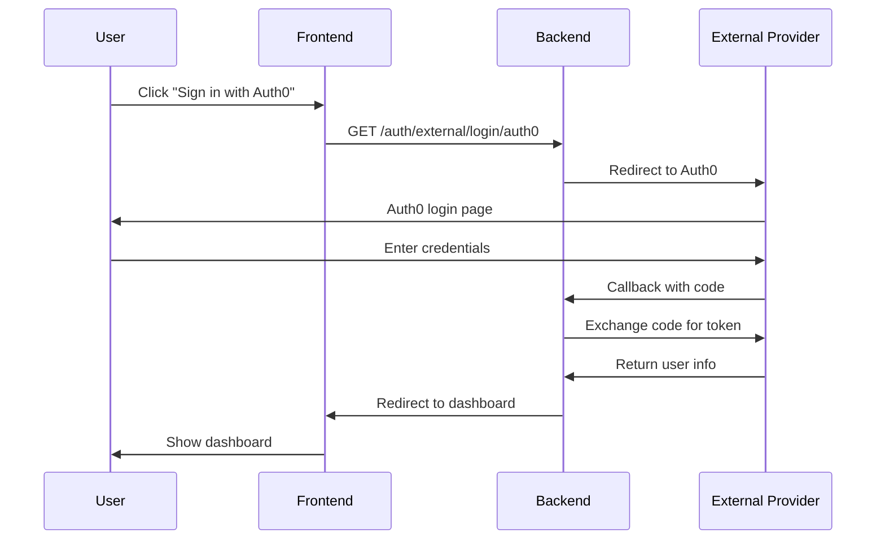

# 🔐 外部認証サービス統合

疾患を抱える消費者向けプラットフォームの外部認証サービス統合ガイド

## 📋 概要

このドキュメントでは、Auth0、Google Cloud Identity、Keycloak、Firebaseなどの外部認証サービスとの統合方法を説明します。

## 🏆 推奨構成

### **第1選択: Auth0** 🥇
**理由:**
- 医療業界向けのHIPAA準拠
- 多要素認証（MFA）の豊富なオプション
- ソーシャルログイン対応
- 詳細な認証ログとアナリティクス
- 無料プランあり（7,000 MAUまで）

### **第2選択: Keycloak** 🥈
**理由:**
- 完全無料・オープンソース
- 自己ホスティング可能
- 高いカスタマイズ性
- 医療業界での実績

### **第3選択: Google Cloud Identity** 🥉
**理由:**
- GCPとの完全統合
- 企業向けの高度なセキュリティ
- 無料プランあり

## 🚀 セットアップ

### 1. Auth0設定

#### 1.1 Auth0アカウント作成
```bash
# Auth0ダッシュボードでアプリケーション作成
# https://manage.auth0.com/
```

#### 1.2 環境変数設定
```bash
# .env ファイルに追加
AUTH_PROVIDER=auth0
AUTH0_DOMAIN=your-domain.auth0.com
AUTH0_CLIENT_ID=your-client-id
AUTH0_CLIENT_SECRET=your-client-secret
AUTH0_AUDIENCE=your-api-identifier
AUTH0_REDIRECT_URI=http://localhost:3000/auth/callback
```

#### 1.3 Auth0ダッシュボード設定
```json
{
  "allowedCallbackUrls": [
    "http://localhost:3000/auth/callback",
    "https://your-domain.com/auth/callback"
  ],
  "allowedLogoutUrls": [
    "http://localhost:3000",
    "https://your-domain.com"
  ],
  "allowedWebOrigins": [
    "http://localhost:3000",
    "https://your-domain.com"
  ]
}
```

### 2. Keycloak設定

#### 2.1 Keycloak起動
```bash
# Docker Composeで起動
version: '3.8'
services:
  keycloak:
    image: quay.io/keycloak/keycloak:latest
    environment:
      KEYCLOAK_ADMIN: admin
      KEYCLOAK_ADMIN_PASSWORD: admin
    ports:
      - "8080:8080"
    command: start-dev
```

#### 2.2 環境変数設定
```bash
# .env ファイルに追加
AUTH_PROVIDER=keycloak
KEYCLOAK_DOMAIN=http://localhost:8080
KEYCLOAK_REALM=healthcare
KEYCLOAK_CLIENT_ID=healthcare-client
KEYCLOAK_CLIENT_SECRET=your-keycloak-client-secret
KEYCLOAK_REDIRECT_URI=http://localhost:3000/auth/callback
```

#### 2.3 Keycloak設定
```bash
# レルム作成
# クライアント作成
# ユーザー作成
# ロール設定
```

### 3. Google Cloud Identity設定

#### 3.1 Google Cloud Console設定
```bash
# Google Cloud ConsoleでOAuth 2.0クライアント作成
# https://console.cloud.google.com/
```

#### 3.2 環境変数設定
```bash
# .env ファイルに追加
AUTH_PROVIDER=google_cloud
GOOGLE_CLIENT_ID=your-google-client-id
GOOGLE_CLIENT_SECRET=your-google-client-secret
GOOGLE_REDIRECT_URI=http://localhost:3000/auth/callback
```

## 🔧 実装

### バックエンド統合

#### 1. 外部認証エンドポイント追加
```python
# app_auth.py に追加
from auth_external_endpoints import external_auth_router
app.include_router(external_auth_router)
```

#### 2. 依存関係インストール
```bash
pip install requests python-jose[cryptography]
```

#### 3. 環境変数設定
```bash
# 外部認証サービス設定
export AUTH_PROVIDER="auth0"
export AUTH0_DOMAIN="your-domain.auth0.com"
export AUTH0_CLIENT_ID="your-client-id"
export AUTH0_CLIENT_SECRET="your-client-secret"
```

### フロントエンド統合

#### 1. 外部認証ボタン追加
```tsx
// src/components/auth/LoginForm.tsx に追加
import ExternalAuthButtons from './ExternalAuthButtons';

export default function LoginForm() {
  return (
    <div>
      <ExternalAuthButtons />
      {/* 既存のログインフォーム */}
    </div>
  );
}
```

#### 2. 認証フック更新
```tsx
// src/hooks/useAuth.ts に追加
const handleExternalAuth = async (provider: string) => {
  try {
    const response = await fetch(`/api/auth/external/login/${provider}`);
    if (response.ok) {
      const data = await response.json();
      if (data.redirect_url) {
        window.location.href = data.redirect_url;
      }
    }
  } catch (error) {
    console.error('External authentication failed:', error);
  }
};
```

## 🔌 APIエンドポイント

### 外部認証エンドポイント

```http
GET  /auth/external/login/{provider}     # 外部認証ログイン
GET  /auth/external/callback            # 認証コールバック
GET  /auth/external/providers           # 利用可能プロバイダー一覧
POST /auth/external/link/{provider}     # 外部アカウント連携
GET  /auth/external/link/callback       # 連携コールバック
GET  /auth/external/health             # 外部認証ヘルスチェック
```

### 認証フロー



## 🛡️ セキュリティ考慮事項

### 1. 状態トークン検証
```python
# 状態トークン生成
state = secrets.token_urlsafe(32)
request.session["auth_state"] = state

# 状態トークン検証
stored_state = request.session.get("auth_state")
if not stored_state or stored_state != state:
    raise HTTPException(status_code=400, detail="Invalid state parameter")
```

### 2. トークン検証
```python
# 外部トークン検証
async def validate_external_token(self, token: str) -> bool:
    try:
        headers = {"Authorization": f"Bearer {token}"}
        response = requests.get(f"{self.base_url}/userinfo", headers=headers)
        return response.status_code == 200
    except:
        return False
```

### 3. セッション管理
```python
# セッション情報の安全な保存
request.session["auth_state"] = state
request.session["auth_provider"] = provider

# セッション情報のクリア
request.session.pop("auth_state", None)
request.session.pop("auth_provider", None)
```

## 📊 パフォーマンス最適化

### 1. トークンキャッシュ
```python
# Redisを使用したトークンキャッシュ
import redis
redis_client = redis.Redis(host='localhost', port=6379, db=0)

def cache_token(token: str, user_info: dict, ttl: int = 3600):
    redis_client.setex(f"token:{token}", ttl, json.dumps(user_info))
```

### 2. 接続プール
```python
# HTTP接続プールの設定
import requests
from requests.adapters import HTTPAdapter
from urllib3.util.retry import Retry

session = requests.Session()
retry_strategy = Retry(
    total=3,
    backoff_factor=1,
    status_forcelist=[429, 500, 502, 503, 504],
)
adapter = HTTPAdapter(max_retries=retry_strategy)
session.mount("http://", adapter)
session.mount("https://", adapter)
```

## 🧪 テスト

### 外部認証テスト

```python
# test_external_auth.py
import pytest
from fastapi.testclient import TestClient

def test_auth0_login():
    response = client.get("/auth/external/login/auth0")
    assert response.status_code == 302
    assert "auth0.com" in response.headers["location"]

def test_google_login():
    response = client.get("/auth/external/login/google")
    assert response.status_code == 302
    assert "accounts.google.com" in response.headers["location"]

def test_keycloak_login():
    response = client.get("/auth/external/login/keycloak")
    assert response.status_code == 302
    assert "keycloak" in response.headers["location"]
```

### 統合テスト

```bash
# 外部認証統合テスト実行
python -m pytest test_external_auth.py -v

# カバレッジ付きテスト実行
python -m pytest test_external_auth.py --cov=auth_providers --cov=auth_external_endpoints
```

## 🚀 本番環境デプロイ

### 1. 環境変数設定

```bash
# 本番環境設定
export AUTH_PROVIDER="auth0"
export AUTH0_DOMAIN="your-production-domain.auth0.com"
export AUTH0_CLIENT_ID="your-production-client-id"
export AUTH0_CLIENT_SECRET="your-production-client-secret"
export AUTH0_AUDIENCE="your-production-api-identifier"
export AUTH0_REDIRECT_URI="https://your-domain.com/auth/callback"
```

### 2. セキュリティチェックリスト

- [ ] 強力なクライアントシークレットの設定
- [ ] HTTPSの有効化
- [ ] リダイレクトURIの制限
- [ ] 状態トークンの検証
- [ ] トークンの有効期限設定
- [ ] ログ監視の設定

### 3. 監視設定

```python
# 認証ログの監視
import logging

logger = logging.getLogger("auth")

def log_auth_event(event_type: str, user_id: str, provider: str):
    logger.info(f"Auth event: {event_type}, user: {user_id}, provider: {provider}")
```

## 🔧 トラブルシューティング

### よくある問題

1. **認証エラー**: リダイレクトURIの不一致
2. **トークン検証エラー**: クライアントシークレットの不一致
3. **状態トークンエラー**: セッション設定の問題

### ログ確認

```bash
# 認証ログの確認
tail -f logs/auth.log

# 外部認証ログの確認
tail -f logs/external_auth.log
```

## 📚 参考資料

- [Auth0統合ガイド](https://auth0.com/docs/quickstart/backend/fastapi)
- [Keycloak統合ガイド](https://www.keycloak.org/docs/latest/securing_apps/)
- [Google Cloud Identity統合ガイド](https://cloud.google.com/identity/docs)
- [Firebase認証統合ガイド](https://firebase.google.com/docs/auth)

## 🤝 コントリビューション

外部認証サービスの統合改善については、以下の手順でお願いします：

1. フィーチャーブランチの作成
2. 外部認証テストの追加
3. セキュリティレビューの実施
4. プルリクエストの作成

## 📄 ライセンス

この外部認証システムは、Healthcare Community Platformの一部として開発されています。
