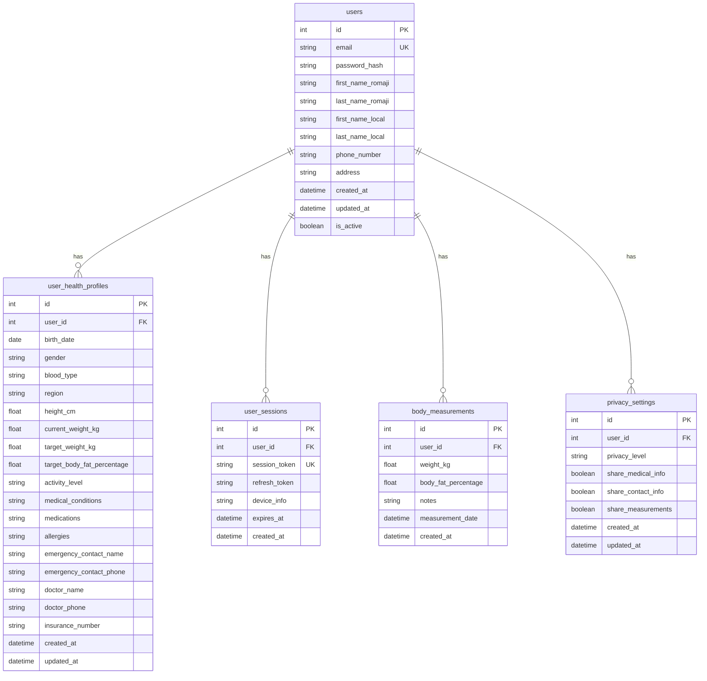

# 新しいデータベース構造

## ER図

## テーブル詳細

### 1. users テーブル（統合ユーザー管理）
- **目的**: 認証と基本プロフィール情報の統合管理
- **特徴**: 
  - ローマ字名と現地言語名の両方をサポート
  - 単一のユーザーIDで全システムを統一
  - 認証情報とプロフィール情報の一元化

### 2. user_health_profiles テーブル
- **目的**: 健康関連情報の管理
- **特徴**:
  - 身体測定値、医療情報、緊急連絡先
  - 目標値と現在値の管理
  - 医療履歴の記録

### 3. user_sessions テーブル
- **目的**: ユーザーセッション管理
- **特徴**:
  - セッショントークンとリフレッシュトークン
  - デバイス情報の記録
  - セッション有効期限管理

### 4. body_measurements テーブル
- **目的**: 体組成測定データの時系列管理
- **特徴**:
  - 体重、体脂肪率の記録
  - 測定日時の管理
  - ノート機能

### 5. privacy_settings テーブル
- **目的**: プライバシー設定の管理
- **特徴**:
  - データ共有レベルの設定
  - カテゴリ別の共有設定
  - ユーザーごとの個別設定

## データ整合性

### 外部キー制約
- `user_health_profiles.user_id` → `users.id`
- `user_sessions.user_id` → `users.id`
- `body_measurements.user_id` → `users.id`
- `privacy_settings.user_id` → `users.id`

### インデックス
- `users.email` (UNIQUE)
- `user_sessions.session_token` (UNIQUE)
- 各テーブルの `user_id` フィールド
- `body_measurements.measurement_date`

## 利点

1. **データ整合性**: 単一のユーザーIDで全システムを統一
2. **パフォーマンス**: JOIN操作の削減、インデックスの最適化
3. **保守性**: 明確なテーブル分離、外部キー制約
4. **拡張性**: 新しい機能の追加が容易
5. **セキュリティ**: プライバシー設定の細かい制御
